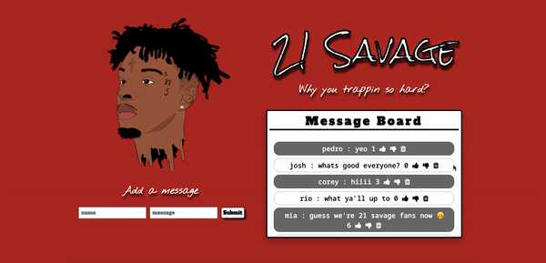

## 🎧  Goal
Create an app where users can post messages to 21 Savage fan board, thumbs up, thumbs down and delete messages from the database.

## 🎧  How it's made
Made using HTML, CSS, Javascript, Node.js, JSON, Express, EJS, MongoDB.
